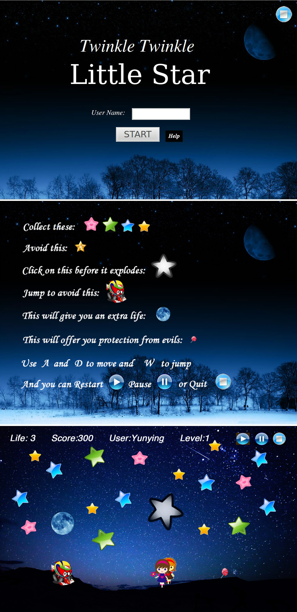

#Game: Catching Stars

##Initial Design
![Initial Design] (./Game.jpg "Initial Design")

##Screen Shot

**Note:** The last picture is still an effect picture I made by photoshop because it's hard
	      to catch a moment when everything appears at the same time in the game.

##Explanation of the game interface
1.  **Girl**

	The player can use the keyboard(left, right, space) to control the little girl.
	
	The girl should collect as many `Star` and `Moon` as possible. The `Score` will increase everytime the `Girl` collides with the `Star`.
	Meanwhile, she must avoid `Car` and `BlackStar`.
	
	Everytime she gets 1000 points, she will have a chance to eat a `Candy`.
	In the candy status, she cannot be hurt be none of `Car`, `BlackStar` or `EvilStar`

2.  **Star**

	The stars will drop from the top of the screen.
	Different colors(Yellow, Blue, Green, Red) will appear randomly.
	Each star worths 20 points.
	If the `Girl` does not collect them, they will disappear after they go out of window.
	As the difficulty level goes up, the there will be fewer and fewer stars appearing in the window.

3. **EvilStar**

    This is the golden evil star.
    It will move in a "Z" shape.
    If the `EvilStar` hits the `Girl`, the girl will lose 10 points.
    
    It will appear randomly. When the difficulty level goes up, it will appear more and more frequently.

3. **BlackStar (aka the `Bomb`)**

	`BlackStar` is like a bomb.
	It will randomly move in the window for 5 seconds. 
	The player must use a `Mouse` to click it in 5 seconds. After clicking, it will disappear.
	After 5 seconds, the `BlackStar` will explode and the girl will lose a life.
	When the difficulty level goes up, the BlackStar will move faster and thus more difficult to hit.

4. **Car**

	The `Car` will appear from the left of the window with a pre-determined time interval.
	It will move horizontally. The player has to press `Space` to make the `Girl` jump to avoid the car.
	If not jump, the girl will lose 300 points.
	When points is below 0, she will lose a life.
	When the difficulty level goes up, the car will move faster and thus more difficult to avoid.

5. **Moon**

	The `Moon` will move down from top of the window.
	It will stop above the girl for about 2 seconds (depend on the level), and then move upward again.
	During that two seconds, the girl can jump to reach the moon.
	She will get an extra life if she reaches the moon. (3 lives maximum)
	When the difficulty level goes up, the moon will stay in the screen for less time.

6. **Candy**

    Each time the `Girl` gets exactly _1000_ points, a candy will occur.
    If the girl "eats" the candy, she will have 7-second "Angel Time". During the Angel Time, 
    `Car`, `Bomb`, `EvilStar`all cannot hurt her.
    The `Candy` will disappear after three seconds if not eaten.

##Rules Summary
####Game Control
1. Keyboard: left, right, space(jump to avoid the car or to reach the moon)

2. Mouse: To click on the Black Star to avoid it from exploding

####Score and Life Calculation
1. When the game starts, the player has three lives.

   When the number of lives reaches zero, game over.

2. Each `Star` worths _20_ points. Each `EvilStar` worths _-20_ points.

   The score will increase/decrease when the girl collides with the star

3. The `Car` worths _-300*level_ points. 
   The score will decrease when the girl collides with the car
   
   If the score decreases to below zero after the deduction, a life will be lost.
   The score will be zero. (`Score` is an unsigned int)

4. When the `BlackStar` explodes, the player loses a life.
   Score remains the same.

5. When the player gets a `Moon`, she gets an extra life.
   If the player still has three lives, she gets no extra life but _700_ extra points.

####Difficulty
Game difficulty will increase as time moves on:

1. The stars will appear less frequently

2. `Car` and `BlackStar` will speed up

3. `EvilStar` will appear more frequently. Finally it may appear more frequently than good star

4. `Moon` will stay for a shorter time and will move faster

5. The Girl will get more deductions in points when she fails to avoid a `Car` (see _Score_ section)

##User Interface

1. User should enter his/her username into the Usernema Box. And then Click `Start` button.

2. If the user clicks `Start` before entering a username, an error message will appear.

3. After the user clicks `Start`, the scene will change to the one in the first part and game starts.

4. When the game is over, a message box will appear to show the username and score. 
   After clicking OK, the game will turns to the Start Screen. (The first picture in the _Screen Show_ section)

5. When the user clicks `Restart`, the game will also turns to the Start Screen.
	
	
